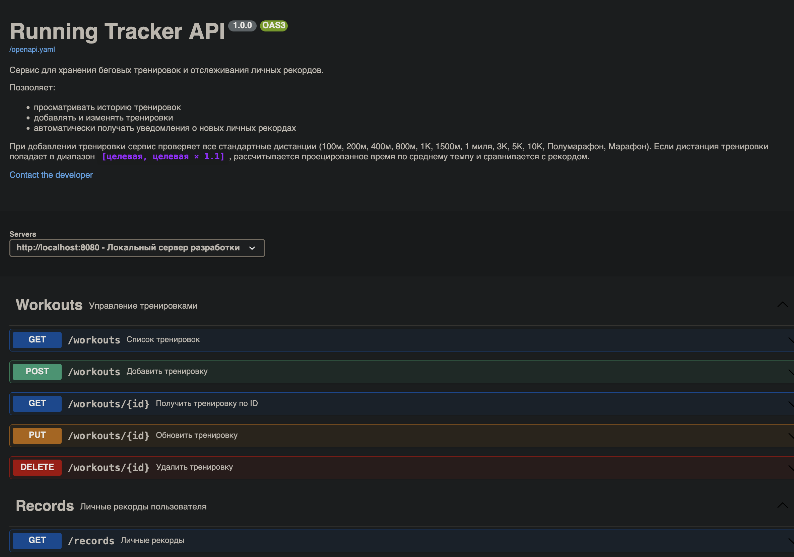
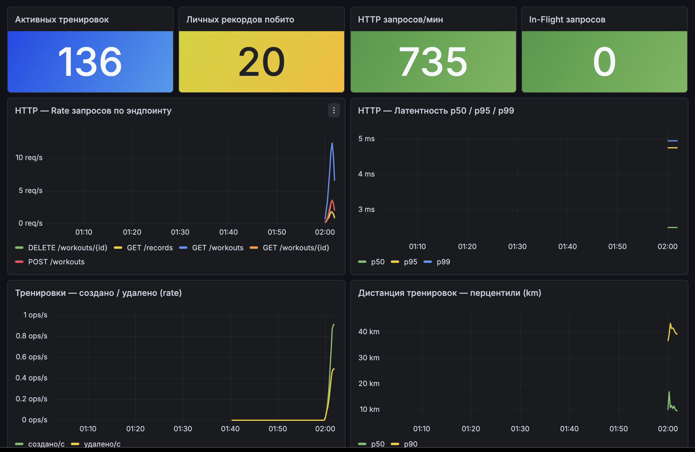

# running-tracker

Сервис сбора и хранения беговых тренировок с автоматическим отслеживанием личных рекордов.

## Фишка — хранит рекорды

При добавлении тренировки сервис проверяет 12 популярных дистанций (от 100м до марафона). Если пробежал чуть больше целевой (до +10%), время пересчитывается по среднему темпу.

**Пример:** 10 500 м за 63 мин = темп 6:00/км → рекорд на 10К записывается как **60:00**.

---

## Стек

- Go 1.23
- chi
- swaggo/http-swagger
- In-memory storage
- OpenAPI 3.0
- prometheus/client_golang
- Prometheus
- Grafana
- log/slog (JSON-логи)
- Loki (хранение логов)
- Grafana Alloy (агент-сборщик)

---

## Структура проекта

```
.
├── cmd/server/main.go
├── internal/
│   ├── handlers/workouts.go
│   ├── logger/
│   │   ├── logger.go        # JSON-slog с MultiWriter
│   │   └── middleware.go    # HTTP-логгер с request_id
│   ├── metrics/
│   │   ├── metrics.go       # объявление метрик
│   │   └── middleware.go    # HTTP middleware
│   ├── models/
│   └── storage/
├── configs/
│   ├── prometheus.yml
│   ├── loki.yml
│   ├── alloy.alloy          # пайплайн: tail файла → Loki
│   └── grafana/
│       ├── provisioning/    # авто-подключение datasource и дашбордов
│       └── dashboards/      # JSON дашборд
├── scripts/run-all.sh
├── Makefile
└── openapi.yaml
```

---

## Быстрый старт

```bash
make run-all
```

| Сервис     | Адрес                                    |
|------------|------------------------------------------|
| API        | http://localhost:8080                    |
| Grafana    | http://localhost:3000                    |
| Swagger    | http://localhost:8080/swagger/index.html |
| Метрики    | http://localhost:8080/metrics            |
| Prometheus | http://localhost:9090                    |
| Loki       | http://localhost:3100                    |
| Alloy UI   | http://localhost:12345                   |

Первый раз — установить инструменты: `make install-tools`


## Эндпоинты

```
GET    /workouts          список тренировок (?limit=20&offset=0)
POST   /workouts          добавить тренировку → {workout, new_records}
GET    /workouts/{id}     тренировка по ID
PUT    /workouts/{id}     обновить тренировку
DELETE /workouts/{id}     удалить тренировку

GET    /records           личные рекорды
```

Полная спецификация: `GET /openapi.yaml`

## Формат запроса

```json
POST /workouts
{
  "name": "Воскресный забег",
  "distance_km": 10.5,
  "duration_min": 63.0,
  "avg_heart_rate": 158,
  "date": "2026-04-29"
}
```

```json
201 Created
{
  "workout": { "id": 11, "distance_km": 10.5, "pace_min_per_km": 6, ... },
  "new_records": [
    {
      "distance_name": "10К",
      "time_min": 60,
      "message": "Первый рекорд на 10К: 1:00:00 (темп 6:00/км)!"
    }
  ]
}
```

---

## Метрики

Prometheus scrape: `GET /metrics`, интервал 5с. Дашборд подгружается автоматически при `make run-all`.

**HTTP:**

| Метрика | Тип | Лейблы | Описание |
|---|---|---|---|
| `http_requests_total` | счётчик | `method`, `path`, `status_code` | Суммарное число запросов |
| `http_request_duration_seconds` | гистограмма | `method`, `path` | Latency |
| `http_requests_in_flight` | gauge | — | Запросы в обработке прямо сейчас |

**Продуктовые:**

| Метрика | Тип | Лейблы | Описание |
|---|---|---|---|
| `workouts_created_total` | счётчик | — | Создано тренировок за всё время |
| `workouts_deleted_total` | счётчик | — | Удалено тренировок за всё время |
| `workouts_active_total` | gauge | — | Текущее количество тренировок |
| `workout_distance_km` | гистограмма | — | Распределение дистанций новых тренировок |
| `personal_records_broken_total` | счётчик | `distance_name` | Побитые личные рекорды по дистанциям |

### Примеры PromQL

```promql
# RPS по эндпоинтам
sum(rate(http_requests_total[1m])) by (method, path)

# p95 latency
histogram_quantile(0.95, sum(rate(http_request_duration_seconds_bucket[1m])) by (le))

# Доля ошибок
sum(rate(http_requests_total{status_code=~"[45].."}[1m])) / sum(rate(http_requests_total[1m]))

# Медианная дистанция новых тренировок
histogram_quantile(0.50, sum(rate(workout_distance_km_bucket[10m])) by (le))
```


## Логи

Структурированные JSON-логи на `log/slog`. Пишутся в stdout и в `data/app/app.log`. Файл тейлит Grafana Alloy и пушит в Loki.

**Формат строки:**

```json
{"time":"2026-05-05T18:39:02Z","level":"INFO","msg":"workout created",
 "service":"running-tracker","request_id":"...-000023",
 "id":11,"distance_km":5,"duration_min":24,"new_records":1}
```

**Лейблы Loki:**

| Лейбл     | Тип             | Источник                        |
|-----------|-----------------|---------------------------------|
| `service` | static          | задаётся в `alloy.alloy`        |
| `job`     | static          | задаётся в `alloy.alloy`        |
| `level`   | low cardinality | парсится из JSON, индексируется |

Высококардинальные поля (`request_id`, `path`, `status`, `method`) лежат в JSON-теле и достаются через `| json` парсер на запросе — это даёт богатую фильтрацию без раздувания индекса.

**Что генерирует приложение:**

- HTTP-запросы (`msg=http_request`) — каждый запрос: method, path, status, latency_ms, request_id, bytes. Уровень адаптивен: 5xx → `ERROR`, 4xx → `WARN`, иначе `INFO`.
- Бизнес-события: `workout created`, `workout updated`, `workout deleted`, `personal record broken`.
- Ошибки валидации: `invalid request body`, `invalid workout input`, `workout not found` (`WARN`).
- Старт сервиса: `storage initialized`, `server starting` (`INFO`).

### Примеры LogQL

```logql
# все логи приложения
{service="running-tracker"}

# только ошибки и предупреждения
{service="running-tracker", level=~"WARN|ERROR"}

# проблемные запросы (4xx + 5xx)
{service="running-tracker"} | json | status >= 400

# бизнес-события: побитые рекорды
{service="running-tracker"} | json | msg = "personal record broken"

# объём логов по уровню (для timeseries)
sum by (level) (count_over_time({service="running-tracker"}[1m]))

# топ-5 путей с ошибками
topk(5, sum by (path) (count_over_time({service="running-tracker"} | json | status >= 400 [5m])))

# процент проблемных строк (% WARN+ERROR)
sum(count_over_time({service="running-tracker", level=~"WARN|ERROR"}[5m]))
  / sum(count_over_time({service="running-tracker"}[5m]))

# p95 latency из логов (а не из метрик), per path
quantile_over_time(0.95, {service="running-tracker"} | json | unwrap latency_ms [5m]) by (path)
```

Открой http://localhost:3000/explore, выбери datasource **Loki** — поэкспериментируй вживую. Готовый дашборд: http://localhost:3000/d/running-tracker-v1.

---

## Скриншоты



